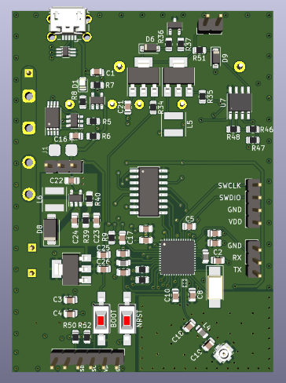
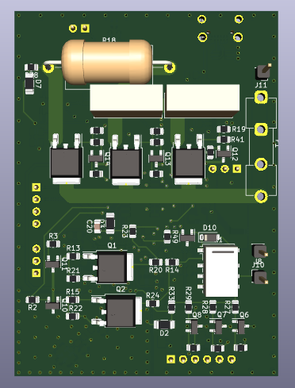

STM32 BLE multimeter

Multimeter features:
-USB rechargable LiPo blattery
-BLE controll and data streaming
-auto range detection
-optional OLED display/button controll

Measurment types:
-DC voltage 0 - 60V
-DC current 0 - 10A (5 sec)
-DC power 0 - 600 W (5 sec)
-Resistance 1-1M ohm
-Inductance 
-Capacitance (non-polarised)
-Diode 3.3V

PCB FRONT:

PCB BACK:

